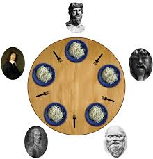

* This activity has been created as part of the 42 curriculum by nalayyou *

# Description
  this activity is a simulation of the [dining philosophers](https://en.wikipedia.org/wiki/Dining_philosophers_problem) with some changes to it. 

  Visual Representation 

  
  
  coders (representing philosophers) alternatively compile, debug, or refactor.
- While compiling, they are not debugging nor refactoring;
- while debugging, they are not compiling nor refactoring;
- and, of course, while refactoring, they are not compiling nor debugging.

  there are as many dongles (forks) as coders. a coder needs their left and right dongles to compile.
  when a coder is done compiling they put both dongles back and starting debugging. 

  when a coder is done debugging, they start refactoring.

  The simulation stops when a coder burns out due to lack of compiling.
# Instruction 

# Resources
- https://dev.to/yel-bakk/codexion-4fk8 
- https://github.com/DeRuina/philosophers/tree/main/src
