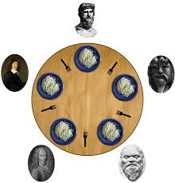

*This activity has been created as part of the 42 curriculum by nalayyou*

# Description
  this activity is a simulation of the [dining philosophers](https://en.wikipedia.org/wiki/Dining_philosophers_problem) with some changes to it. 

  Visual Representation 

  
  
  coders (representing philosophers) alternatively compile, debug, or refactor.
- While compiling, they are not debugging nor refactoring;
- while debugging, they are not compiling nor refactoring;
- and, of course, while refactoring, they are not compiling nor debugging.

  there are as many dongles (forks) as coders. a coder needs their left and right dongles to compile.
  when a coder is done compiling they put both dongles back and starting debugging. 

  when a coder is done debugging, they start refactoring.

  The simulation stops when a coder burns out due to lack of compiling.

  ## Important concepts to understand before starting the project
    -  concurrent programming : managing multiple tasks at once. on a single core CPU the processor will quickly switch between tasks. tasks are in execution during the same time period but only one is actively executed at any given instant.
 
    -  parallelism : is executing multiple tasks at the exact same time. this is only possible with a multiple core CPU.
    
    - process vs thread : a process consists of one or more threads. a process is a management concept , resources are allocated to a process and not a thread. all threads belonging to the same process get access to the same resources.
    
    - mutex : stands for mutually exclusive flag/object which is self explanatory. a flag is mutual between threads but is exclusive to one at a time.
    
    - lockout freedom : a concept linked to mutex, it guarantees that every thread that wishes to enter the critical section will do so eventually. no process remains in critical section permanently.
 
    - race condition : it occurs when two or more processes or threads try to access and/or modify data at the same time. the result is determined by which one was milliseconds faster.
 
    - user level threads vs kernel level threads : in short user level threads (green threads) are managed by your language and cant take advantage of parallelism [for more info](https://stackoverflow.com/questions/15983872/difference-between-user-level-and-kernel-supported-threads)

  ## getting started with pthread library
    - creating a thread
      ```
      pthread_create( address of empty pthread_t variable, struct for attributes of thread, function that the thread will run, one piece of data that you want to pass to previous said function)
      example
      pthread_t t;
      pthread_create(&t, NULL, say_hello, NULL);
      ```
    - waiting for a thread to finish
      ```
      pthread_join(t, NULL);
      ```
    - terminating the calling thread explicitly
      ```
      pthread_exit(NULL);
      ```
## Blocking cases handled

- **Deadlock prevention:** Circular wait (one of Coffman's four conditions) is broken. Odd coders take their left dongle first, even coders take their right first, so a cycle of "everyone holds one dongle and waits for the next" can't form. If the second dongle can't be acquired, the first is released.
- **Single coder:** With only one dongle, the coder waits until `time_to_burnout` and burns out instead of blocking forever.
- **Starvation prevention:** The scheduler decides who gets a contested dongle. `fifo` serves requests in arrival order; `edf` serves the coder closest to burnout first. <!-- VERIFY -->
- **Cooldown:** A released dongle can't be taken again until `dongle_cooldown` ms have passed. <!-- VERIFY: how it's checked -->
- **Precise burnout detection:** A monitor thread checks every coder about every 1 ms and prints the burnout itself. <!-- VERIFY: print_state must skip output once state_of_sim is 0 -->
- **Log serialization:** All output goes through one mutex so lines never interleave. <!-- VERIFY: mutex name -->

## Thread synchronization mechanisms

| Primitive | Used for |
|-----------|----------|
| `pthread_mutex_t` (per dongle) | Exclusive access to a dongle |
| `pthread_cond_t` (per dongle) <!-- VERIFY --> | Sleep until the dongle is free or its cooldown ends, with no busy-waiting |
| `simulation_mutex` | `state_of_sim`, `time_of_last_compile`, `compiles_left` |
| Log mutex <!-- VERIFY --> | Serialized printing |

**Race conditions prevented:**
- A coder writes `time_of_last_compile` and `compiles_left` under `simulation_mutex`; the monitor reads them under the same mutex, so it never sees a stale or partial value.
- `state_of_sim` is only written under `simulation_mutex`, so all coders see the stop consistently.

**Coder/monitor communication:** Shared state guarded by `simulation_mutex`. Coders publish progress, the monitor polls it, and the monitor sets `state_of_sim = 0` to stop everyone. Coders check it between phases and in `smart_sleep`.

**Shutdown:** `main` joins the monitor and all coders before `cleanup`, so no mutex is destroyed while still in use.

## project layout
main.c        → checks 8 args, validates, calls simulate()
simulation.c  → builds everything, spawns N coder threads + 1 monitor thread, joins them
  ├─ coder thread:   compile → debug → refactor (loop)   [routine()]

  └─ monitor thread: watches for burnout / everyone done [monitor.c]

server.c      → the "dongle server": hands dongles to coders in scheduled order
pq.c / pq_helpers.c → the priority queue (min-heap) that server.c uses


# Instructions

## Usage

```bash
git clone <repo_url>
cd codexion
make
./codexion number_of_coders time_to_burnout time_to_compile time_to_debug \
           time_to_refactor number_of_compiles_required dongle_cooldown scheduler
```

- All times are in milliseconds.
- `scheduler` is `fifo` or `edf`.

Example:

```bash
./codexion 5 800 200 200 200 7 50 fifo
```

# Resources
- [threading playlist on youtube](https://www.youtube.com/playlist?list=PLfqABt5AS4FmuQf70psXrsMLEDQXNkLq2)
- [article about the project](https://dev.to/yel-bakk/codexion-4fk8) 
- [github repo for the project](https://github.com/ahmad-nashwan/Philosophers)
- [another github repo for the project](https://github.com/DeRuina/philosophers)
- [difference between concurrent and parallel programming](https://www.geeksforgeeks.org/operating-systems/difference-between-concurrency-and-parallelism/)
- [threads and why theyre needed](https://www.codequoi.com/en/threads-mutexes-and-concurrent-programming-in-c/)
- [difference between fork and clone](https://stackoverflow.com/questions/4856255/the-difference-between-fork-vfork-exec-and-clone)
- [process vs thread](https://www.reddit.com/r/explainlikeimfive/comments/k1ig1e/eli5_the_difference_between_a_process_and_a_thread/)
- [process vs thread more in depth](https://algomaster.io/learn/concurrency-interview/processes-vs-threads)
- [what is mutual exclusion](https://en.wikipedia.org/wiki/Mutual_exclusion)
- [codexion visualizer](https://codexion-visualizer.sacha-dev.me/)
- [gdb debugger tutorial](https://web.eecs.umich.edu/~sugih/pointers/summary.html)
- [mutexes on microinstruction level](https://www.linkedin.com/pulse/hardware-behind-mutexes-risc-v-yusif-kazimli-90hhe)
- [what are enums](https://www.w3schools.com/c/c_enums.php)
- [heaps](https://dev.to/paulike/heap-sort-1j4h)
- [priority queue](www.youtube.com/watch?v=yntfI_jqNms)
- [how does cpu schedule](www.youtube.com/watch?v=O2tV9q6784k&t=52s)
- [makefile tutorial](https://makefiletutorial.com/#why-do-makefiles-exist)
- [why use stderr](https://stackoverflow.com/questions/19870331/why-use-stderr-when-printf-works-fine)
- [buffers in c](https://medium.com/@sreehema2025/understanding-buffers-in-c-why-your-printf-might-not-show-up-immediately-98c4d9d60d75)
- [makefile tutorial in practice](https://github.com/clementvidon/Makefile_tutor#version-1)
- [purpose of pthread condition variables](https://www.onenoughtone.com/learn/pthread-condition-variables)
- [tester](https://github.com/Overtekk/Codexion)
- man page
- AI was used for README, help with debugging, planning project and norminette
